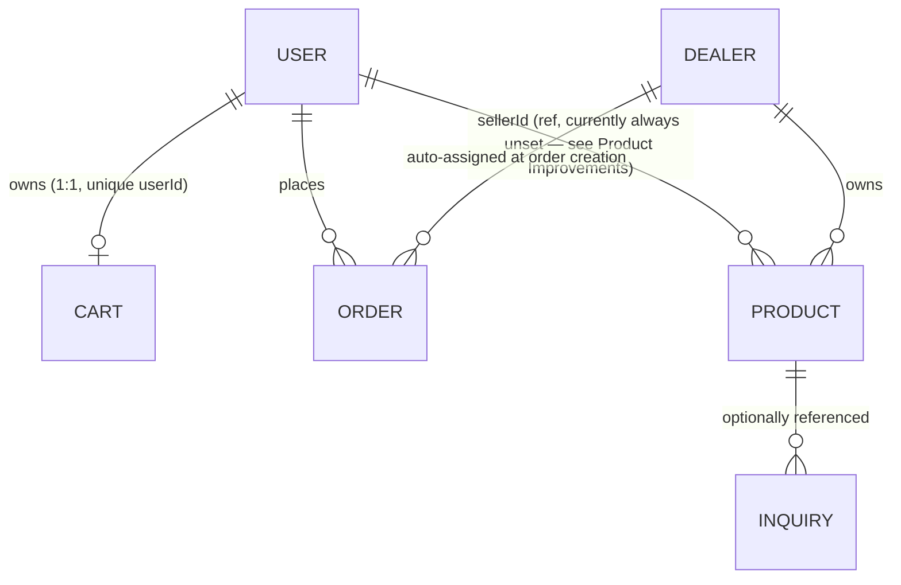

# Arefriz — Database Documentation

**Type:** Descriptive documentation of the live MongoDB schema, read-only. No code was modified to produce this document.
**Scope:** The 6 collections used by the actively-running backend (repo root `models/`). The frozen, unreferenced duplicate backend at `backend/backend/models/` defines its own diverged `Cart`/`Order`/etc. schemas — see `docs/PROJECT_AUDIT.md` §16 — and is **not** documented here since it isn't part of the running system. If that directory is ever executed against the same database, several of its schemas (notably `Cart`) are structurally incompatible with the live ones and would corrupt the shared collection; this is called out again under Cart's Improvements.

**Collections:** `users`, `dealers`, `products`, `carts`, `orders`, `inquiries`

---

## 1. `users`

### Purpose
Account store for both customers and admins (single collection, differentiated by `role`). Registration/login/admin-login all operate on this collection.

### Fields
| Field | Type | Required | Default | Notes |
|---|---|---|---|---|
| `name` | String | yes | — | |
| `email` | String | yes | — | unique index |
| `password` | String | yes | — | bcrypt hash (cost 10) |
| `role` | String enum: `buyer`, `seller`, `admin` | no | `buyer` | `seller` value is declared but no seller-specific workflow exists anywhere in the codebase |
| `status` | String enum: `pending`, `approved` | no | `approved` | declared but never read or transitioned by any controller |
| `createdAt` / `updatedAt` | Date | — | auto | `timestamps: true` |

### Relationships
- `Cart.userId` → `User._id` (required, unique — enforces one cart per user)
- `Order.userId` → `User._id` (optional ref)
- `Product.sellerId` → `User._id` (optional ref — see Improvements, this is currently always unset for products created via the public flow)
- No document embeds a `User` reference back to `Cart`/`Order` — lookups go one direction only (query `Cart`/`Order` by `userId`).

### Used by controllers
- `controllers/authController.js` — `registerUser`, `loginUser`, `adminLogin` (the only controller that queries the `User` model directly).
- Every other controller interacts with the user only indirectly, via `req.user = {id, role}` set by `middleware/authMiddleware.js` from the JWT payload — they never re-query `User`.

### Validation
- Schema-level `required` on `name`/`email`/`password`.
- `email` has a `unique: true` index (enforced by MongoDB, not an application-level format check — no regex/format validation exists, so a syntactically invalid but unique string would be accepted).
- `role`/`status` constrained to their enum value sets by Mongoose.
- No password strength/length policy at any layer.

### Suggested indexes
- The unique index on `email` (already present via `unique: true`) covers the only real query pattern (`User.findOne({email})` on every login/register call) — sufficient.
- No additional index currently justified; if an admin "list all sellers/admins" view is ever added, a `{role: 1}` index would help.

### Improvements
- `role: 'seller'` and `status: 'pending'/'approved'` are dead enum values — no controller ever sets a user to `seller` or reads `status` for any gating decision. Either build the intended seller workflow or remove them to avoid misleading future readers.
- No email format validation at the application layer.
- `User.findOne({email})` in `authController.js` returns the full document including the password hash into a local variable that's then compared/discarded — not currently leaked to any response, but there's no `.select('-password')` guard, so a future accidental `res.json(user)` in this file would leak password hashes. Worth adding defensively.
- No account lockout / login-attempt throttling — combined with the debug `console.log`s of the plaintext password and hash in `loginUser` (already flagged in `PROJECT_AUDIT.md` §17/§18), this collection's auth path has more than one hardening gap.

---

## 2. `dealers`

### Purpose
Accounts for third-party dealers who own products in the marketplace and fulfill orders assigned to them for a commission.

### Fields
| Field | Type | Required | Default | Notes |
|---|---|---|---|---|
| `name` | String | yes | — | |
| `companyName` | String | yes | — | |
| `email` | String | yes | — | unique index |
| `password` | String | yes | — | bcrypt hash (cost 10) |
| `phone` | String | yes | — | no format validation |
| `isActive` | Boolean | no | `true` | login is rejected with 403 if `false` |
| `createdAt` / `updatedAt` | Date | — | auto | `timestamps: true` |

### Relationships
- `Product.dealerId` → `Dealer._id` (nullable — a product may have no dealer)
- `Order.dealerId` → `Dealer._id` (nullable — auto-populated at order creation from the first ordered product that has a `dealerId`)

### Used by controllers
- `controllers/dealerController.js` — `registerDealer`, `loginDealer`, `adminCreateDealer` (all three CRUD/auth operations on `Dealer`).
- `controllers/dealerProductController.js` — reads `Dealer` to validate ownership on dealer-scoped product actions.
- `routes/adminRoutes.js` (inline handlers, no controller) — also directly requires the `Dealer` model to create and list dealers from the admin panel — see Improvements, this duplicates `dealerController`'s creation logic.

### Validation
- Schema-level `required` on `name`/`companyName`/`email`/`password`/`phone`.
- `email` unique index.
- `isActive` gate checked only at login time (an already-issued JWT for a dealer later deactivated remains valid until it expires — `dealerAuthMiddleware` does not re-check `isActive` per request).
- No phone format validation, no password policy.

### Suggested indexes
- Unique index on `email` (already present) covers the primary login lookup.
- Add `{isActive: 1}` if the admin dealer-management list frequently filters active vs. inactive dealers (currently a small collection, so low urgency).

### Improvements
- `adminCreateDealer` (`dealerController.js`) and the inline dealer-creation handler in `routes/adminRoutes.js` implement identical bcrypt-hash-then-`Dealer.create` logic in two places — consolidate to one function to avoid the two drifting apart.
- `isActive` is checked only at login, not per-request — a deactivated dealer's existing token keeps working for up to 7 days (the JWT expiry) after deactivation.
- No audit trail for deactivation (no `deactivatedAt`, no reason field).

---

## 3. `products`

### Purpose
The product catalog — items customers browse, add to cart, and order; may be owned by an admin/seller or by a dealer.

### Fields
| Field | Type | Required | Default | Notes |
|---|---|---|---|---|
| `name` | String | yes | — | text-indexed |
| `brand` | String | yes | — | |
| `category` | String | yes | — | |
| `price` | Number | yes | — | |
| `sku` | String | no | — | |
| `type` | String | no | — | |
| `shortDescription` | String | no | — | |
| `description` | String | no | — | |
| `specs` | Array of `{key, value}` | no | — | free-form key/value spec list |
| `stock` | Boolean | no | `true` | **in-stock flag, not a quantity** — see Improvements |
| `installationCost` | Number | no | — | |
| `image` | String | no | — | primary image path |
| `images` | Array of String | no | — | gallery |
| `sellerId` | ObjectId (ref `User`) | no | — | see Improvements — currently always unset via the public creation path |
| `dealerId` | ObjectId (ref `Dealer`) | no | `null` | |
| `dealerName` | String | no | `null` | denormalized copy of the dealer's name |
| `status` | String enum: `pending`, `approved` | no | `approved` | admin moderation flag — no `rejected` value exists |
| `createdAt` / `updatedAt` | Date | — | auto | `timestamps: true` |

### Relationships
- `sellerId` → `User._id` (optional)
- `dealerId` → `Dealer._id` (optional)
- Referenced by `Cart.items[].productId` (typed `ObjectId`, with `ref: 'Product'`)
- Referenced by `Order.products[].productId` (typed `String`, **no** `ref` set — see Improvements, type mismatch vs. Cart)
- Referenced by `Inquiry.productId` (optional, `ObjectId`, `ref: 'Product'`)
- Note: none of `Cart`, `Order`, or `Inquiry` actually `.populate()` these references in the live code paths that matter for cart/order responses — cart and order line items instead store a denormalized snapshot (`name`, `price`, `image` copied at write time).

### Used by controllers
- `controllers/productController.js` — public CRUD (`addProduct`, list, `getProductById`, etc.).
- `controllers/dealerProductController.js` — dealer-scoped CRUD, gated to the dealer's own `dealerId`.
- `controllers/cartController.js` / `controllers/orderController.js` — read `Product` to look up authoritative price/name/dealer info when adding to cart or creating an order.
- `routes/adminRoutes.js` (inline handlers) — admin product listing/filtering and `status` toggling (approve/reject), bypassing a dedicated controller.

### Validation
- Schema-level `required` on `name`/`brand`/`category`/`price`; everything else is optional.
- `status` constrained to `pending`/`approved` by enum.
- No validation that `price`/`installationCost` are non-negative.
- No validation on `images[]` entries being valid URLs/paths.

### Suggested indexes
Already well-indexed for current query patterns:
- `{status: 1, createdAt: -1}` — public catalog listing (approved products, newest first)
- `{status: 1, category: 1}` — category browsing
- `{dealerId: 1, createdAt: -1}` — dealer's own product list
- Text index on `name` — search

Consider adding, if these become real query patterns:
- `{status: 1, brand: 1}` if brand filtering is added to the catalog UI.
- Expanding the text index to include `description`/`brand` (`productSchema.index({name: 'text', description: 'text', brand: 'text'})`) for broader search recall.

### Improvements
- **`sellerId: req.user.userId` in `productController.addProduct` is always `undefined`** — `authMiddleware` sets `req.user = {id, role}`, not `.userId`. Every product created via the public add-product flow silently loses its seller attribution. (Documented previously in `PROJECT_AUDIT.md`.)
- **`stock` is a Boolean, not a quantity** — there is no inventory count anywhere in the schema, and correspondingly no code decrements stock when an order is placed. This means there's no overselling protection and no low-stock signal; the field can only ever express "available" vs. "unavailable" as a manual toggle.
- **`status` enum has no `rejected` value** — admin moderation can only mark a product `pending` or `approved`; there's no way to explicitly reject a dealer-submitted listing (it would just stay `pending` indefinitely, or an admin would have to delete it).
- No `updatedBy`/moderation-audit fields (who approved/rejected, when).
- `dealerName` is a denormalized copy of the dealer's name at product-creation time — if a dealer later changes their `companyName`/`name`, existing products won't reflect the update.

---

## 4. `carts`

### Purpose
One cart document per user — the live shopping-cart state used for the add-to-cart, cart-view, and checkout flows.

### Fields
| Field | Type | Required | Default | Notes |
|---|---|---|---|---|
| `userId` | ObjectId (ref `User`) | yes | — | **unique index** — enforces exactly one cart per user |
| `items` | Array | no | `[]` | see sub-fields below |
| `items[].productId` | ObjectId (ref `Product`) | yes | — | |
| `items[].name` | String | yes | — | denormalized snapshot |
| `items[].price` | Number | yes | — | denormalized snapshot, not re-synced |
| `items[].image` | String | no | `''` | denormalized snapshot |
| `items[].quantity` | Number | no | `1` | no min/max bound enforced |
| `totalAmount` | Number | no | `0` | derived field, recalculated by the controller on every mutation |
| `createdAt` / `updatedAt` | Date | — | auto | `timestamps: true` |

### Relationships
- `userId` → `User._id`, 1:1 (unique index on `userId` is what makes this a true one-cart-per-user relationship at the DB level, not just an application convention).
- `items[].productId` → `Product._id`.

### Used by controllers
- `controllers/cartController.js` — exclusively owns all cart mutations: `addToCart`, `getCart`, `updateCartItem`, `removeFromCart`, `clearCart`.
- `controllers/orderController.js` — reads/clears the cart as part of `createOrder` (`Cart.findOneAndUpdate({userId}, {$set: {items: []}})` after an order is placed).

### Validation
- `userId` required + unique (DB-level one-cart-per-user guarantee).
- `items[].productId`/`name`/`price` required at the schema level.
- **No bound on `quantity`** — `addToCart` takes `quantity` from the request body with only a `quantity || 1` fallback for falsy values (so `0`/`undefined`/`null` become `1`), but a negative number or an absurdly large number passes through unvalidated.
- No validation that `productId` actually corresponds to an existing `Product` document before being pushed into `items[]`.

### Suggested indexes
- The existing unique index on `userId` is also the only query pattern in use (`Cart.findOne({userId})` in every handler) — sufficient as-is. No further indexes are needed at current scale.

### Improvements
- **Price/name/image snapshots never refresh** — if a product's real price changes after it's added to a cart, the cart continues showing the stale price until the item is removed and re-added. No mechanism reconciles cart line items against current `Product` data.
- **No quantity bounds validation** — a malicious or buggy client could set a negative or extreme quantity.
- **`totalAmount` is fragile denormalization** — it's correctly recalculated by every current controller method, but nothing enforces that at the schema level (no pre-save hook); a future direct write to `Cart` that forgets to recompute it would silently desync the stored total from the actual sum of `items[]`.
- **⚠ Do not run the frozen `backend/backend/` fork against this same database.** Its `Cart` model uses a completely different, incompatible shape (`products[]` + `totalAmount`, no `userId`, no ownership) mapped to the same default `carts` collection name — mixing the two schemas in one collection would produce documents neither implementation can reliably read.

---

## 5. `orders`

### Purpose
Placed customer orders, including line items, shipping details, payment status, and dealer assignment/commission/fulfillment tracking.

### Fields
| Field | Type | Required | Default | Notes |
|---|---|---|---|---|
| `orderId` | String | — | auto (`ARF#####`, random 5-digit) | unique index; **no collision-retry logic** on save |
| `userId` | ObjectId (ref `User`) | no | `null` | |
| `products` | Array | no | — | see sub-fields |
| `products[].productId` | **String** | no | `null` | **typed `String`, no `ref`** — inconsistent with `Cart.items[].productId` (`ObjectId` + `ref`) |
| `products[].name` | String | yes | — | |
| `products[].price` | Number | yes | — | |
| `products[].quantity` | Number | yes | — | |
| `products[].image` | String | no | `''` | |
| `subtotal` | Number | yes | — | |
| `logisticsCost` | Number | yes | — | |
| `installationCost` | Number | yes | — | |
| `taxes` | Number | yes | — | |
| `techSurcharge` | Number | no | `0` | |
| `totalAmount` | Number | no | — | not marked `required` despite being the order's headline figure |
| `shippingDetails.name/phone/address` | String | yes (each) | — | |
| `paymentStatus` | enum: `pending`, `paid`, `released` | no | `pending` | `'released'` never set by any code path |
| `paymentId` | String | no | `null` | |
| `dealerId` | ObjectId (ref `Dealer`) | no | `null` | auto-assigned at creation |
| `dealerName` | String | no | `null` | denormalized |
| `commissionPercent` | Number | no | `20` | always overwritten with the literal `20` at creation regardless of this default mechanism |
| `adminAmount` | Number | no | `0` | |
| `dealerAmount` | Number | no | `0` | |
| `dealerPaid` | Boolean | no | `false` | |
| `dealerPayoutStatus` | enum: `pending`, `released` | no | `pending` | **never mutated anywhere** — dead field |
| `paymentMethod` | enum: `upi`, `card`, `cod` | no | `null` | |
| `orderStatus` | enum: `placed`, `processing`, `shipped`, `delivered`, `cancelled` | no | `processing` | **`'placed'` never assigned** — orders are created directly into `processing` |
| `statusHistory` | Array of `{status, date}` | no | — | **declared, never pushed to by any controller** — dead field |
| `notes` | String | no | `''` | |
| `dealerEmail` | String | no | `null` | set when a dealer notification email is sent |
| `emailSent` | Boolean | no | `false` | only maintained by one of the two dealer-email code paths (see `SYSTEM_DESIGN.md` §9) |
| `emailSentAt` | Date | no | `null` | same caveat as `emailSent` |
| `createdAt` / `updatedAt` | Date | — | auto | `timestamps: true` |

### Relationships
- `userId` → `User._id` (optional)
- `dealerId` → `Dealer._id` (optional, auto-populated from the first ordered product's `dealerId`)
- `products[].productId` → conceptually `Product._id`, but stored as an untyped `String` with no `ref`, so Mongoose cannot `populate()` it even if desired.

### Used by controllers
- `controllers/orderController.js` — `createOrder`, `getOrders`, `updateOrderStatus`, `sendToDealer`.
- `controllers/dealerOrderController.js` — dealer-scoped order list and `updateDealerOrderStatus` (writes gated to `{_id, dealerId: req.dealer.id}`).
- `routes/adminOrderRoutes.js` (inline handlers, no controller) — `pay-dealer`, a second `send-to-dealer` implementation, list, and a duplicate `updateOrderStatus`-equivalent route pointed at the same controller function as `orderRoutes.js`.

### Validation
- Schema-level `required` on `products[].name/price/quantity`, `shippingDetails.*`, and the cost breakdown fields (`subtotal`, `logisticsCost`, `installationCost`, `taxes`).
- Enum constraints on `paymentStatus`, `paymentMethod`, `orderStatus`, `dealerPayoutStatus`.
- `orderId` unique index, but the generator (`Math.floor(10000 + Math.random()*90000)`) has no collision-retry — a duplicate-key error on save is theoretically possible (low probability at current volume, but unhandled if it occurred).
- **No transition guard on `orderStatus`** — any of the four reachable values can move to any other, from either the admin or the assigned-dealer endpoint, with no ordering enforced.
- `totalAmount` itself is not `required`/validated despite being the figure everything downstream (payment, dealer payout) depends on.

### Suggested indexes
Already reasonably indexed for the current query patterns:
- `{userId: 1, createdAt: -1}` — "my orders"
- `{dealerId: 1, createdAt: -1}` — dealer's assigned orders
- `{orderStatus: 1, createdAt: -1}` — admin filtering by status
- `orderId` unique index (implicit from `unique: true`)

Consider adding:
- `{paymentStatus: 1, createdAt: -1}` if admin/finance ever needs to query outstanding vs. paid orders at scale.
- `{dealerId: 1, dealerPaid: 1}` if a "dealers awaiting payout" admin view is built.

### Improvements
- **Type mismatch**: `products[].productId` should be `ObjectId` with `ref: 'Product'` to match `Cart.items[].productId` and enable `populate()`.
- **Dead fields**: `orderStatus: 'placed'`, `paymentStatus: 'released'`, `dealerPayoutStatus`, and `statusHistory[]` are declared but never written by any controller — either wire them into the actual lifecycle or remove them to stop misleading readers of the schema.
- **No order-status transition guard** — add an explicit allowed-transitions table so e.g. `delivered → processing` can't happen via a stray API call.
- **`pay-dealer` conflates two concepts in one write**: it sets both `dealerPaid: true` and `paymentStatus: 'paid'` together, even though "the dealer received their commission" and "the buyer's payment cleared" are logically independent facts (documented in `SYSTEM_DESIGN.md` §8b).
- **`orderId` generation has no retry-on-collision** — add a retry loop or switch to a guaranteed-unique scheme (e.g. an incrementing counter or a longer random suffix).
- **Commission is hardcoded to 20% at order-creation time** in `createOrder`, ignoring the schema's own `commissionPercent` default mechanism as a place to vary it per-dealer or per-product — if per-dealer commission rates are ever needed, this hardcoding will need to move.

---

## 6. `inquiries`

### Purpose
Public contact-form / product-inquiry submissions — not tied to a logged-in account, can be submitted by any site visitor.

### Fields
| Field | Type | Required | Default | Notes |
|---|---|---|---|---|
| `name` | String | yes | — | |
| `email` | String | yes | — | validated by regex in the controller (not schema-level) |
| `phone` | String | yes | — | no format validation |
| `message` | String | yes | — | |
| `productId` | ObjectId (ref `Product`) | no | `null` | optional — inquiry may be general or product-specific |
| `status` | enum: `new`, `in-progress`, `resolved` | no | `new` | |
| `createdAt` / `updatedAt` | Date | — | auto | `timestamps: true` |

### Relationships
- `productId` → `Product._id` (optional).
- No relationship to `User` — inquiries are anonymous/guest submissions by design.

### Used by controllers
- `controllers/inquiryController.js` exclusively — create, list, update status, and admin reply.

### Validation
- Schema-level `required` on `name`/`email`/`phone`/`message`.
- `inquiryController.js` additionally performs a manual email-format regex check before creating the document — one of the only controllers in the codebase that validates input beyond bare `required` presence.
- No check that `productId`, if supplied, actually references an existing `Product`.
- No rate limiting on the public creation endpoint (unauthenticated).

### Suggested indexes
No indexes currently declared on this collection. Suggest:
- `{status: 1, createdAt: -1}` — the admin inquiry dashboard almost certainly filters/sorts by status; without an index this becomes a full collection scan as volume grows.
- `{email: 1}` — if inquiries are ever looked up by submitter (e.g. "show all inquiries from this email").

### Improvements
- Add the `{status: 1, createdAt: -1}` index described above before this collection grows large — it currently has zero indexes beyond the default `_id`.
- Add rate limiting to the public inquiry-creation endpoint — no auth is required to submit, so it's an open spam/abuse surface.
- Validate `productId` exists before saving, to avoid inquiries silently pointing at deleted/nonexistent products.

---

## Cross-Cutting Database Observations

- **No shared reference typing convention**: the same conceptual "product reference" is `ObjectId` in `Cart` and `String` in `Order` — pick one convention (recommend `ObjectId` + `ref` everywhere, as `Cart` and `Inquiry` already do) and migrate `Order.products[].productId`.
- **No schema-level `min`/`max` bounds anywhere** — quantities, prices, and cost fields all accept any positive-or-negative number the application code happens to pass in; validation is entirely the application's responsibility today and is inconsistently applied.
- **Denormalization without reconciliation**: `Cart`, `Order`, and `Product.dealerName` all snapshot data from another collection at write time with no mechanism to refresh it later — acceptable for order history (orders should reflect what was true at purchase time) but a real staleness risk for the live `Cart`.
- **Two collections (`orders`, and none currently on `users`/`dealers`) have well-chosen compound indexes; two collections (`inquiries`, and implicitly `carts` beyond its single unique index) have none beyond `_id`/the one required unique key** — worth a pass once real traffic volume is known, rather than guessing further indexes preemptively.

This document does not modify any code, schema, or index — all suggestions above are recommendations only.
