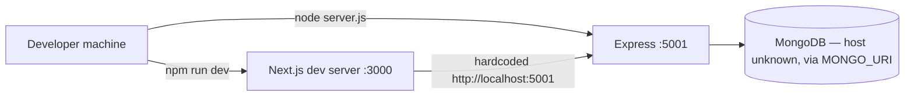
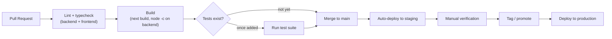
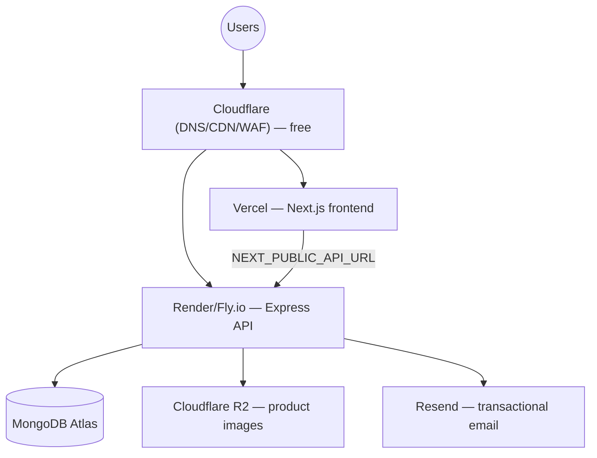

# Arefriz — Deployment Roadmap: Local → Production

**Type:** Forward-looking DevOps roadmap, read-only. No code, config, or infrastructure was modified to produce this document.
**Principle applied throughout:** free/low-cost solutions by default; a paid or "enterprise" tool is only recommended where explicitly justified by a concrete scale trigger, never by default.
**Companion docs:** `docs/PROJECT_AUDIT.md`, `docs/SYSTEM_DESIGN.md`, `docs/DATABASE.md`, `docs/CODE_REVIEW.md` — this roadmap assumes their findings and references them rather than repeating full detail.

---

## 1. Current Architecture

Verified by reading the repo (not assumed):

- **Backend**: Express 5 + Mongoose 9, runs via `node server.js` on `PORT` (default `5001`), local-only, no process manager, no containerization.
- **Frontend**: Next.js App Router, runs via the Next dev/start scripts on port `3000`.
- **Database**: MongoDB, connected via `MONGO_URI` from `.env` — no evidence of which tier/host (local vs. Atlas) is currently used; the `.env` file exists at the repo root (correctly gitignored) but its contents weren't read here.
- **File storage**: local disk (`uploads/`) via Multer, served back through `express.static` — see §5 and §7, this is a hard blocker for anything beyond a single-instance deployment.
- **Email**: two competing providers wired in — Resend (`RESEND_API_KEY`) and Gmail via Nodemailer (`EMAIL_USER`/`EMAIL_PASS`) — see `CODE_REVIEW.md` §3.
- **No CI/CD**: no `.github/workflows/` directory exists anywhere in the repo.
- **No Docker**: no `Dockerfile` or `docker-compose.yml` anywhere in the repo.
- **No `.env.example`**: required environment variables must currently be reverse-engineered from source (this document does that in §6).
- **A confirmed deployment blocker**: `frontend/src/lib/config.ts` hardcodes `export const BASE_URL = "http://localhost:5001"` — every client-side fetch in the frontend (cart, product cards, admin panels) is wired to this literal. **Deploying the frontend anywhere today would still point production browsers at `localhost:5001`.** This must become an environment variable (`NEXT_PUBLIC_API_URL` or similar) before any real deployment — flagged again in §2 and §6 as a checklist item, not fixed here per the "do not modify code" instruction.

---

## 2. Pre-Deployment Checklist

Ordered by what actually blocks a safe first deployment, drawing on findings already verified in the companion docs:

**Hard blockers (must fix before any deploy):**
- [ ] Replace the hardcoded `BASE_URL` in `frontend/src/lib/config.ts` with an environment variable (e.g. `NEXT_PUBLIC_API_URL`), read consistently everywhere the frontend currently imports `BASE_URL`.
- [ ] Decide on a file-storage strategy other than local disk (§5, §7) — most hosting platforms below use ephemeral or non-shared filesystems; uploaded product images will be lost on redeploy/restart/scale-out otherwise.
- [ ] Remove `admin password.txt` from the repository and rotate that credential (`CODE_REVIEW.md` §1, Critical).
- [ ] Remove the plaintext password/hash/JWT console logging in `authController.js` and `frontend/src/app/login/page.tsx` (`CODE_REVIEW.md` §1/§4, Critical) — do not ship credential logging to a production log aggregator (§9).
- [ ] Fix or retire the admin login flow — it currently cannot succeed (`CODE_REVIEW.md` §10, Critical).

**Strongly recommended before production traffic:**
- [ ] Add `.env.example` documenting every variable in §6.
- [ ] Add a centralized Express error-handling middleware (`CODE_REVIEW.md` §7) so failures return the app's normal JSON shape instead of Express's default HTML page in production.
- [ ] Add `helmet` and basic rate limiting (`CODE_REVIEW.md` §1).
- [ ] Consolidate the two dealer-email implementations into one provider (§6 assumes Resend going forward, since it's already the one wired into the primary admin UI per `SYSTEM_DESIGN.md` §9).
- [ ] Add a lightweight `/health` endpoint (distinct from the existing `/api/test`, which requires auth) for the uptime/monitoring tooling in §8.
- [ ] Pin the Node.js version via an `engines` field in `package.json` (none currently declared) so hosting platforms and Docker builds use a consistent runtime.
- [ ] Decide the `backend/backend/` dead fork's fate — delete it or move it out of the deploy path entirely; make sure no build/deploy script could ever accidentally start it (`PROJECT_AUDIT.md` §16).
- [ ] At minimum, add a couple of smoke tests (health check responds, login responds) — there are currently zero automated tests in the repo, which is also what CI in §4 will initially have nothing to run.

None of the above were changed as part of producing this document — they're the checklist, not actions taken.

---

## 3. Staging Environment

Goal: a low-cost environment that behaves like production but is safe to break.

- **Separate database**: a second MongoDB Atlas free-tier (M0, 512MB, $0) cluster or database name, never shared with production data. Seed it using the existing `seed.js` script.
- **Separate deployments**: 
  - Frontend: a Vercel **Preview Deployment** (automatic on every PR, free on Vercel's Hobby tier) or a dedicated `staging` branch mapped to its own Vercel project.
  - Backend: a second free/low-cost service instance on the same host chosen in §7 (e.g. Render's free web service tier, or a second Fly.io app), pointed at the staging Atlas cluster and staging secrets.
- **Separate secrets**: staging gets its own `JWT_SECRET`, `MONGO_URI`, and email credentials — never reuse production secrets in staging.
- **Promotion flow**: merge to a `staging` branch → auto-deploy to staging → manual verification → merge/promote to `main` → deploy to production (see §4 pipeline).
- **Cost**: effectively $0 at this stage — every component above has a usable free tier.

---

## 4. CI/CD Using GitHub Actions

GitHub Actions is free for public repositories and includes 2,000 free minutes/month for private repositories on GitHub Free — sufficient for this project's likely build volume at early stages.

**Recommended pipeline (build up incrementally — there are no tests yet, so start with what exists):**

- **Stage 1 (today)**: a single workflow on every PR — install deps, run `next lint`/`tsc --noEmit` for the frontend, run `node -c` (or a proper linter) across backend files, run `next build` to catch build-breaking errors like the malformed `app/api/products/route.ts` handler identified in `PROJECT_AUDIT.md` §11 before it ever reaches a deploy.
- **Stage 2 (once §2's smoke tests exist)**: add a `test` job gating merge to `main`.
- **Stage 3**: add `deploy-staging` (auto, on push to `staging`/`main`) and `deploy-production` jobs. Production deploys should require either a git tag, a manual `workflow_dispatch` trigger, or a GitHub Environment with required reviewers — note that required-reviewer protection on **private** repos requires GitHub Team ($4/user/month) or Enterprise; the free workaround is a manual `workflow_dispatch`-triggered production deploy job instead of automatic promotion.
- **Secrets**: store `MONGO_URI`, `JWT_SECRET`, email credentials, and deploy tokens as GitHub Actions **Encrypted Secrets** (free, per-repo or per-environment) — never in the workflow file itself.
- **Cost**: $0 at current and near-term build volume.

---

## 5. Docker Strategy

No Dockerfiles exist yet. Recommended approach once containerization is warranted (useful even before a cloud migration, for local dev parity):

- **Backend**: a multi-stage Node Dockerfile — a `deps` stage installing production dependencies, a final slim `node:<LTS>-alpine` runtime stage copying only `node_modules` + source, running as a non-root user, exposing `PORT`.
- **Frontend**: Next.js supports a `standalone` output mode (`output: 'standalone'` in `next.config.ts`, not currently set) specifically designed for small Docker images — a multi-stage build (deps → build → slim runtime copying `.next/standalone`) is the standard low-cost pattern.
- **`docker-compose.yml` for local development**: backend + frontend + a local `mongo` service, so new contributors get a working stack with one command instead of manually installing/configuring MongoDB locally — directly improves onboarding, which is currently undocumented (no `.env.example`, per §2).
- **Do not containerize `uploads/` as a bind-mounted local volume and call it solved** — a single-host volume still doesn't survive horizontal scaling or most managed-container platforms' redeploys. Fix the storage backend (§7) before or alongside containerizing, not after.
- **Cost**: $0 — Docker itself is free; where you *run* the containers is what costs money (§7).

---

## 6. Environment Variables

Verified by grepping `process.env` usage across the live codebase — this is the authoritative list of what actually exists today (an `.env.example` should be created from this table per §2):

### Backend
| Variable | Used in | Purpose |
|---|---|---|
| `MONGO_URI` | `config/db.js`, `seed.js` | MongoDB connection string |
| `JWT_SECRET` | `authMiddleware.js`, `dealerAuthMiddleware.js`, `authController.js`, `dealerController.js` | JWT signing/verification secret — shared across all three auth flows |
| `PORT` | `server.js` | Express listen port (defaults to `5001`) |
| `EMAIL_FROM` | `config/email.js` | Resend "from" address |
| `RESEND_API_KEY` | `controllers/orderController.js` | Resend API key (dealer-email Flow A) |
| `EMAIL_USER` / `EMAIL_PASS` | `routes/adminOrderRoutes.js` | Gmail SMTP credentials (dealer-email Flow B) — recommend retiring once the two email flows are consolidated (§2) |

### Frontend
| Variable | Used in | Purpose |
|---|---|---|
| `API_URL` | every `app/api/*` Next.js route handler (server-side proxy layer) | backend base URL for server-to-server calls |
| **`NEXT_PUBLIC_API_URL` (does not exist yet — recommended)** | should replace the hardcoded `BASE_URL` in `lib/config.ts` | backend base URL for client-side `fetch` calls — this is the §1/§2 blocker |

### Recommendations
- Create `.env.example` at both the backend root and `frontend/` with placeholder values for every row above.
- Never store production secrets in the repo, CI config files, or Docker images — use GitHub Actions Secrets (§4) and the hosting platform's environment-variable dashboard (§7), both free.
- Use distinct values per environment (local/staging/production) for `JWT_SECRET`, `MONGO_URI`, and email credentials — a leaked staging secret should never grant production access.
- Validate required secrets are present at process startup (currently nothing checks this — a missing `JWT_SECRET` fails silently at `jwt.sign(payload, undefined)` rather than at boot, per `PROJECT_AUDIT.md` §17).

---

## 7. Production Deployment

Recommended stack, chosen for low/no cost at low-to-moderate traffic with a clear low-cost upgrade path:

| Layer | Recommendation | Why |
|---|---|---|
| Frontend hosting | **Vercel** (Hobby tier free; Pro $20/month if the Hobby tier's non-commercial-use terms or limits become a problem) | First-party Next.js support, free TLS, free CDN, zero-config preview deployments — the natural fit for this exact framework |
| Backend hosting | **Render** or **Fly.io** (both have free tiers with cold-start caveats; Render's paid Starter tier is $7/month, Fly.io's smallest always-on VM is roughly similar) | Simple Node deployment, free TLS, environment-variable dashboard, easy horizontal scaling later without re-platforming |
| Database | **MongoDB Atlas M0** (free, 512MB) → **M2/M5** (~$9-$25/month) once free-tier limits are hit | Managed, no ops burden, matches the Mongoose driver already in use, has a clear low-cost upgrade ladder before jumping to dedicated clusters |
| File storage | **Cloudflare R2** (free egress, 10GB storage free) or a low-volume AWS S3 bucket | Removes the local-disk blocker identified in §1/§5; R2's free egress is specifically attractive for image-serving workloads |
| DNS / CDN / basic WAF | **Cloudflare** free plan | Free TLS, DDoS mitigation basics, and a CDN layer in front of both frontend and any direct API traffic |
| Domain | ~$10-15/year from any standard registrar | Not free, but negligible cost |

**Deployment note**: do not deploy the `backend/backend/` duplicate folder as part of any build — confirm the chosen host's build command (`npm run build`/`npm start`) resolves to the root `server.js`, not the nested copy.

---

## 8. Monitoring

| Need | Free/low-cost tool | Notes |
|---|---|---|
| Uptime checks | **UptimeRobot** free tier (50 monitors, 5-minute interval) | Point it at the `/health` endpoint added in §2 |
| Error tracking (frontend + backend) | **Sentry** free tier (5,000 errors/month, 1 team member) | Directly addresses the "no error boundary, errors currently invisible" finding in `CODE_REVIEW.md` §6 — wire up both the Express backend and the Next.js frontend |
| Host-native metrics (CPU/memory/response time) | Render/Fly/Vercel built-in dashboards | Free, included with hosting, no extra setup |
| Upgrade trigger | Sentry Team tier (~$26/month) once >1 person needs alert routing/ownership; **do not adopt a full APM suite (Datadog, New Relic) until team size or incident volume clearly justifies the cost** | Enterprise observability is not justified at this project's current stage |

---

## 9. Logging

- **Replace `console.log`/`console.error`/`console.warn`** (used throughout, including the credential-logging findings in `CODE_REVIEW.md` §1/§4) **with a structured logger** — `pino` is free, extremely low-overhead, and outputs JSON that every log aggregator below can parse.
- **Hard rule, not optional**: never log passwords, password hashes, JWTs, or full request bodies containing credentials. This directly fixes the Critical findings already documented.
- **Aggregation**: most PaaS (Render, Fly, Vercel) capture stdout/stderr automatically and show it in a free built-in logs tab — sufficient for the earliest stage. For longer retention and searchability, **Better Stack (Logtail)** free tier (1GB/month) or **Axiom** free tier (0.5GB/day) are low-cost options that accept JSON logs directly.
- **Request correlation**: add a request-id middleware (e.g. a simple UUID per request attached to `req` and echoed in every log line for that request) — makes tracing a single failed checkout across log lines tractable, which today's ad-hoc `console.log` calls don't support.

---

## 10. Backups

- **Database**: Atlas M0 (free tier) has **no automated backups**. Until upgrading to M10+ (which includes continuous backups), schedule a nightly `mongodump` via a GitHub Actions scheduled workflow (`on: schedule`, free) that uploads the dump to the same R2/S3 bucket used for uploads (§7) — cheap and simple at this stage.
- **File storage**: enable versioning on the R2/S3 bucket (free/low-cost) as the backup mechanism for uploaded product images.
- **Retention** (adjust once compliance/business requirements are known — none are documented today): daily backups kept 7 days, weekly kept 4 weeks, monthly kept 6 months.
- **Restore drills**: actually test a restore quarterly. An untested backup is a hypothesis, not a backup — cheap to verify, easy to skip if not scheduled deliberately.
- **Upgrade trigger**: move to Atlas's built-in continuous backup (M10+, ~$60-90/month) once RPO/RTO requirements tighten beyond what a nightly dump provides, or once backup/restore operational overhead outweighs the cost difference.

---

## 11. Scaling

Scale in this order — cheapest lever first:

1. **Vertical scaling** — bump the Render/Fly instance size and the Atlas tier before anything else. Cheapest, zero architectural change.
2. **Fix the horizontal-scaling blockers first** — local-disk file storage (§5/§7) and any in-memory rate limiting must be resolved *before* running multiple backend instances, or behavior will silently diverge between instances.
3. **Horizontal scaling** — once the above is fixed, both Render and Fly.io support running multiple instances behind their built-in load balancer with no extra cost beyond the additional instance(s).
4. **Database read scaling** — apply the missing indexes already identified in `docs/DATABASE.md` (notably on `inquiries`) before assuming more read replicas are needed; Atlas auto-scaling tiers can add read capacity once genuinely warranted by measured load, not preemptively.
5. **CDN offload** — Cloudflare (free) or Vercel's built-in CDN already cache static assets/images once §7's storage migration is done, reducing origin load without additional backend capacity.
6. **Asynchronous work** — move dealer-notification emails (currently sent synchronously inside the request/response cycle in both competing implementations, per `CODE_REVIEW.md` §3) to a background queue once email volume or latency becomes a problem — this is the first concrete trigger for adopting Redis (§12).

---

## 12. Redis Adoption (When Needed)

**Redis is not needed today.** There is no session store beyond stateless JWTs, no caching layer, and no background job queue anywhere in the current codebase — introducing Redis now would be infrastructure without a job to do.

Adopt it when any of these concrete triggers actually occurs:

| Trigger | What Redis solves | Recommended approach |
|---|---|---|
| Backend scales to 2+ instances and rate limiting needs to be shared | In-memory rate limiters (if added per §2) don't coordinate across instances | `rate-limit-redis` backing the rate-limit middleware |
| Product/category read load becomes a measured DB bottleneck | Cache-aside for hot, rarely-changing reads (catalog, category listings) | Simple `GET`/`SETEX` cache-aside pattern around the existing product queries |
| Email volume or latency makes synchronous sending (today's pattern, per `CODE_REVIEW.md` §3) unacceptable | Background job processing with retries | **BullMQ** (Redis-backed queue) for dealer notification emails |
| JWT revocation is needed (deactivated dealer/admin should be logged out immediately, per `CODE_REVIEW.md` §2 finding) | No current mechanism invalidates an issued token before its 7-day expiry | A Redis set of revoked token IDs, TTL matching JWT expiry, checked in the auth middleware |

**Recommended provider when the time comes**: **Upstash Redis** free tier (10,000 commands/day, serverless, pay-per-request beyond that) — avoids paying for an always-on managed Redis instance (~$10+/month on Render/Railway) until usage genuinely exceeds the free tier.

---

## 13. Cloud Migration Roadmap

| Stage | Trigger | Infrastructure |
|---|---|---|
| **0 — Local (today)** | n/a | Local Node processes, local/unknown MongoDB, no cloud presence |
| **1 — Staging/MVP** | Ready to demo/test with real (non-production) users | Vercel (frontend, free), Render/Fly free tier (backend), Atlas M0 (free), Cloudflare R2 free tier, GitHub Actions free tier |
| **2 — Early production** | Real users, real money moving through checkout | Vercel Hobby/Pro, Render Starter ($7/mo) or Fly small VM, Atlas M2/M5 (~$9-25/mo), Sentry free/Team, Cloudflare free, custom domain |
| **3 — Growth** | Sustained traffic growth, measured DB/API bottlenecks | Atlas M10+ with continuous backups (~$60-90/mo), Upstash/managed Redis, 2+ horizontally-scaled backend instances, paid log aggregation tier, Sentry Team |
| **4 — Enterprise scale** | Only if team size, compliance, or traffic clearly justify it — **not recommended by default** | Container orchestration (e.g. managed Kubernetes), dedicated multi-region Atlas clusters, enterprise observability (Datadog/New Relic) |

Stage 4 tools are deliberately not recommended until a concrete trigger justifies them — jumping to Kubernetes or enterprise observability before the team/traffic warrants it adds operational cost and complexity with no corresponding benefit at this project's current stage.

---

## 14. Estimated Cost by Project Stage

| Stage | Monthly cost (approx.) | Breakdown |
|---|---|---|
| 0 — Local dev | **$0** | No cloud resources |
| 1 — Staging/MVP | **$0-5** | All free tiers (Vercel Hobby, Render/Fly free, Atlas M0, Cloudflare free, GitHub Actions free); ~$1/mo if a domain is amortized monthly |
| 2 — Early production | **~$25-60** | Render Starter/Fly VM ($7-25) + Atlas M2/M5 ($9-25) + domain (~$1/mo amortized) + Sentry free or low tier; Cloudflare/R2 still free at this volume |
| 3 — Growth | **~$150-400** | Atlas M10+ (~$60-90) + Redis (~$10-50) + 2-3 backend instances (~$50-150) + paid log aggregation (~$20-50) + Sentry Team (~$26+) |
| 4 — Enterprise scale | **$1,000+** (highly variable) | Only relevant once Stage 4 is actually justified — not a near-term planning number |

These are planning-level estimates based on each provider's current published pricing tiers, not quotes — validate against each provider's pricing page at decision time.

---

No code, configuration, or infrastructure was created or modified while producing this roadmap — every recommendation above is a proposal for future work.
