# Arefriz — System Design Document

**Type:** Descriptive architecture document (current state), read-only. No code was modified to produce this document.
**Companion doc:** see `docs/PROJECT_AUDIT.md` for the full file-by-file audit; this document focuses on runtime behavior and flows.

---

## 1. High-Level Architecture

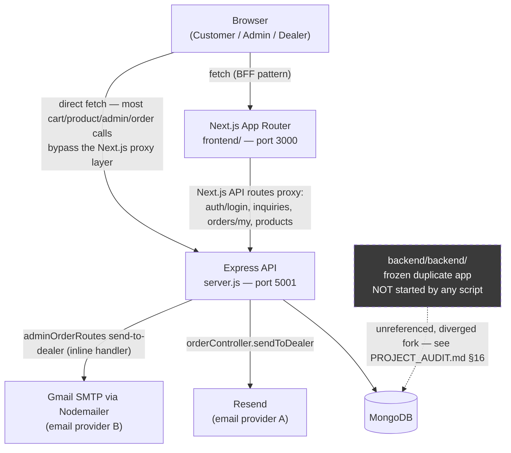

Two client→backend access patterns coexist with no documented rule for which to use: a handful of features (`auth/login`, `inquiries`, `orders/my`, `products` POST) go through Next.js `app/api/*` route handlers as a BFF proxy; everything else (cart, most order/admin actions) calls the Express API directly from client components using a hardcoded `BASE_URL`.

---

## 2. Frontend Architecture

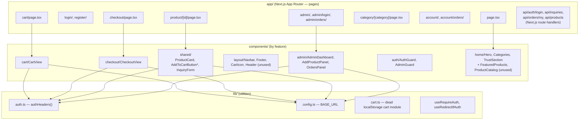

Key characteristics (see also §12 State Management):
- No global state container — every page/component fetches its own data independently.
- `ProductCard.tsx` and `AddToCartButton.tsx` (marked `*` above) duplicate the entire add-to-cart request logic instead of one sharing the other.
- Auth/role checks are implemented three separate times (`AuthGuard.tsx`, `AdminGuard.tsx`, an inline check in `admin/layout.tsx`), all independently reading `localStorage`.

---

## 3. Backend Architecture

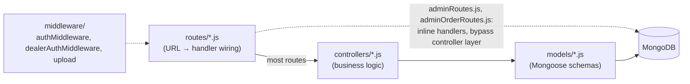

The intended layering is Routes → Controllers → Models, and most resources follow it cleanly (`auth`, `cart`, `product`, `inquiry`, `dealer`, `dealerOrder`). Two route files break this pattern by embedding business logic (dealer CRUD, product moderation, pay-dealer, send-to-dealer) directly in the route file, calling `Model.find/save` without going through a controller — an architectural inconsistency, not a hard blocker.

No service/repository layer exists — controllers call Mongoose models directly. No centralized error-handling middleware exists (see §11).

---

## 4. Database Architecture

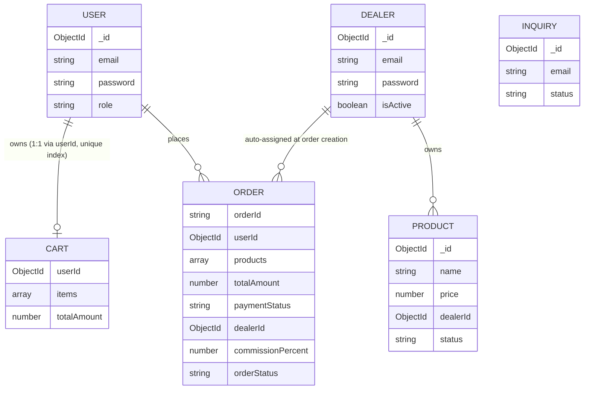

Notable inconsistency: `Cart.items[].productId` is typed `ObjectId` (`models/Cart.js`), while `Order.products[].productId` is typed `String` (`models/Order.js`) — the same real-world reference (a product id) is represented with two different types depending on which document it lives in. Neither model uses Mongoose `populate` for these embedded references in the live code paths that matter (cart/order responses embed a denormalized snapshot of name/price/image at write time instead).

`Order` schema also declares several fields that no code path ever sets, making them dead data: `orderStatus: 'placed'` (enum value, never assigned — orders are created directly into `'processing'`), `dealerPayoutStatus` (never mutated, only `dealerPaid` boolean is used), `paymentStatus: 'released'` (enum value, never assigned), and `statusHistory[]` (declared, never pushed to).

`Product.js` is the best-indexed model (compound indexes on `status+createdAt`, `status+category`, `dealerId+createdAt`, plus a text index on `name`).

---

## 5. Authentication Flow

Three independent JWT-based auth flows exist (customer, admin, dealer), each with its own middleware guard but sharing the same `JWT_SECRET`. All three store the token client-side in `localStorage` (keys `token`, `user`) and send it back as `Authorization: Bearer <token>` — no httpOnly cookies.

### 5a. Customer Login

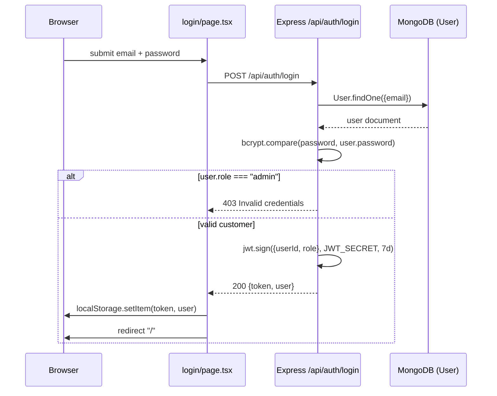

### 5b. Admin Login — currently broken end-to-end

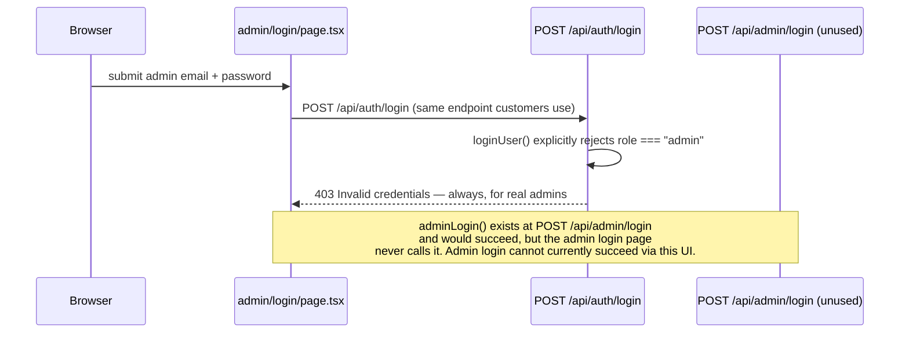

### 5c. Dealer Login

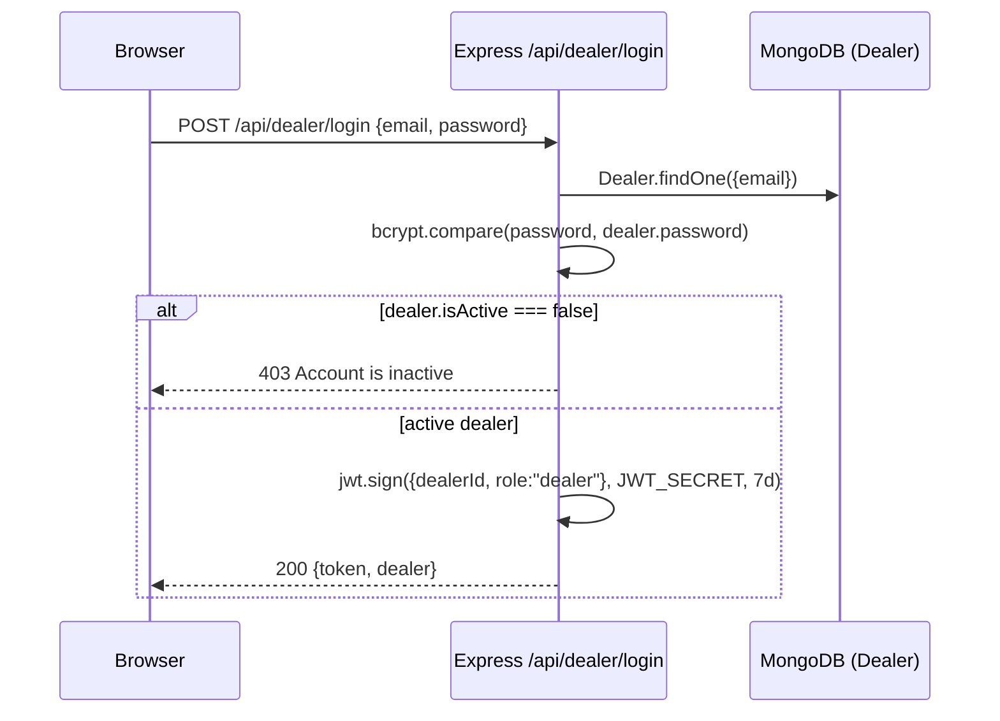

Per-request guards: `middleware/authMiddleware.js`'s `protect` sets `req.user = {id, role}` from the JWT; `adminMiddleware` additionally requires `req.user.role === 'admin'`; `middleware/dealerAuthMiddleware.js` requires `decoded.role === 'dealer'` and sets `req.dealer = {id}`. Route-level protection on the frontend (`AuthGuard`, `AdminGuard`, `admin/layout.tsx`) is a client-only `localStorage` presence/role check with no server round-trip to confirm token validity.

---

## 6. Cart Flow

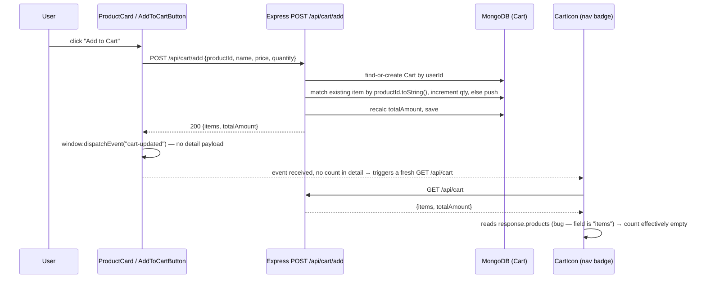

`CartView.tsx` and `CheckoutView.tsx` do **not** listen for the `cart-updated` event — they only fetch once on mount, so an already-open cart/checkout tab won't reflect an item added elsewhere without a manual reload. Both also read `data.products` from the same `{items, totalAmount}` response shape, so their displayed cart contents are built from `undefined` (see PROJECT_AUDIT.md §12/§18 for the full contract-mismatch writeup).

---

## 7. Checkout Flow

```mermaid
sequenceDiagram
    participant U as User
    participant CV as CheckoutView
    participant CartAPI as GET /api/cart
    participant OrderAPI as POST /api/orders
    participant DB as MongoDB
    participant ClearAPI as DELETE /api/cart/clear

    U->>CV: open /checkout
    CV->>CartAPI: GET /api/cart (on mount)
    CartAPI-->>CV: {items, totalAmount}
    CV->>CV: reads data.products (bug) — item list effectively empty from this response;<br/>falls back to per-item GET /api/products/:id lookups
    U->>CV: fill shipping form + select items/shipping/installation
    CV->>CV: compute subtotal, logisticsCost, taxes (18%), installationCost, techSurcharge (client-side)
    U->>CV: submit order
    CV->>OrderAPI: POST /api/orders {products[], shippingDetails, subtotal, logisticsCost, taxes, ...}
    OrderAPI->>DB: re-fetch each Product by id (authoritative name/price/image/dealerId)
    OrderAPI->>OrderAPI: recompute totalAmount server-side from submitted cost components
    OrderAPI->>DB: save Order (orderStatus: "processing")
    OrderAPI->>DB: Cart.findOneAndUpdate — items: []  (totalAmount left stale)
    OrderAPI-->>CV: {orderId}
    CV->>CV: navigate to /order-success (after 2.5s)
    CV->>ClearAPI: DELETE /api/cart/clear (redundant second clear of the same cart)
```

The order-creation endpoint trusts the **client-submitted** line items and cost breakdown (which items, quantities, shipping method, tax) — it only re-verifies each product's authoritative price/name/dealer server-side, and recomputes a total from the client-supplied cost components rather than independently deriving shipping/tax/installation from server-side rules. There is no cross-check against the actual DB cart contents or its stored `totalAmount`.

---

## 8. Order Flow

### 8a. Order status lifecycle

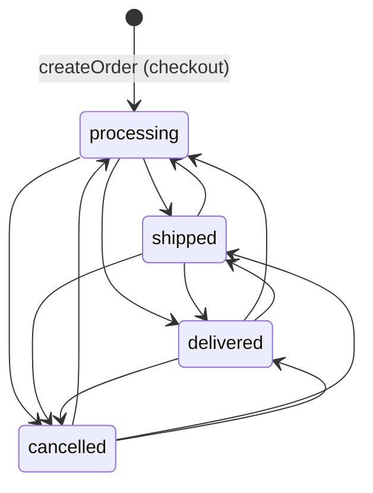

Both an admin (`PATCH /api/orders/:id/status` or the duplicate `PATCH /api/admin/orders/:id`, same underlying `updateOrderStatus` handler) and the assigned dealer (`PATCH /api/dealer/orders/:id/status`, scoped to their own orders) can move an order to any of `processing | shipped | delivered | cancelled` — **there is no transition guard**, so e.g. `delivered → processing` is technically possible via the API. `orderStatus: 'placed'` is declared in the schema enum but no code path ever sets it — orders are created directly into `'processing'`. Dealer assignment happens automatically inside `createOrder`, derived from the first ordered product that has a `dealerId` — it is not a separate admin action.

### 8b. Payment / dealer payout

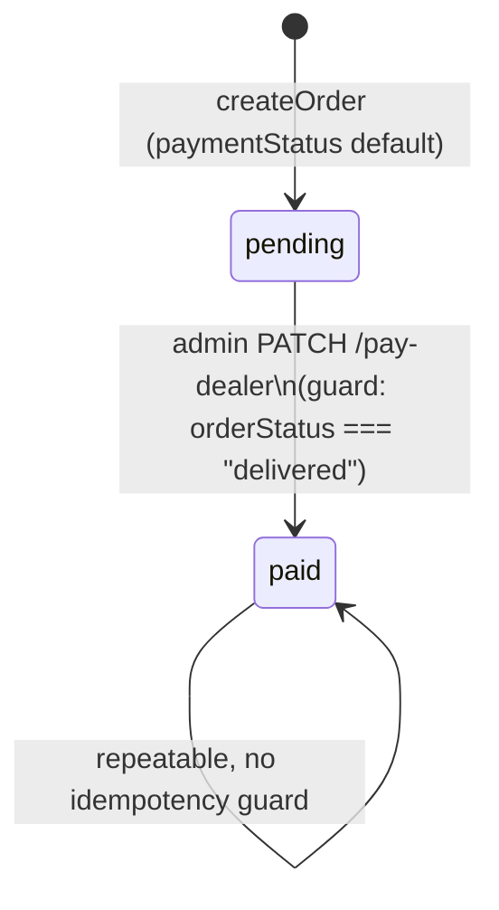

The `pay-dealer` endpoint sets **both** `dealerPaid: true` and `paymentStatus: 'paid'` in the same write — conflating "the dealer's commission was paid out" with "the buyer's payment was received," and unconditionally overwriting `paymentStatus` regardless of its prior value. The schema's `paymentStatus: 'released'` enum value and the separate `dealerPayoutStatus` field are never set by any code path.

---

## 9. Dealer Email Flow

Two independent, competing implementations exist and are both live/reachable:

### 9a. Flow A — `orderController.sendToDealer` (Resend)

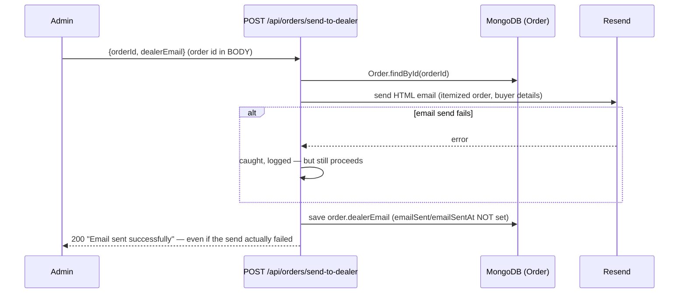

### 9b. Flow B — `adminOrderRoutes.js` inline handler (Nodemailer / Gmail)

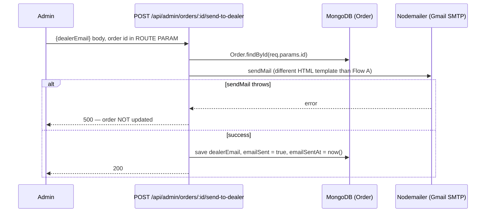

The two flows use different request shapes (body vs. route param for order id), different providers/credentials (`RESEND_API_KEY` vs `EMAIL_USER`/`EMAIL_PASS`), different HTML templates, and only Flow B maintains the `emailSent`/`emailSentAt` fields — making those fields an unreliable signal of "was this order actually emailed" if Flow A was used. The live `OrdersPanel.tsx` admin UI calls Flow A.

---

## 10. Admin Flow

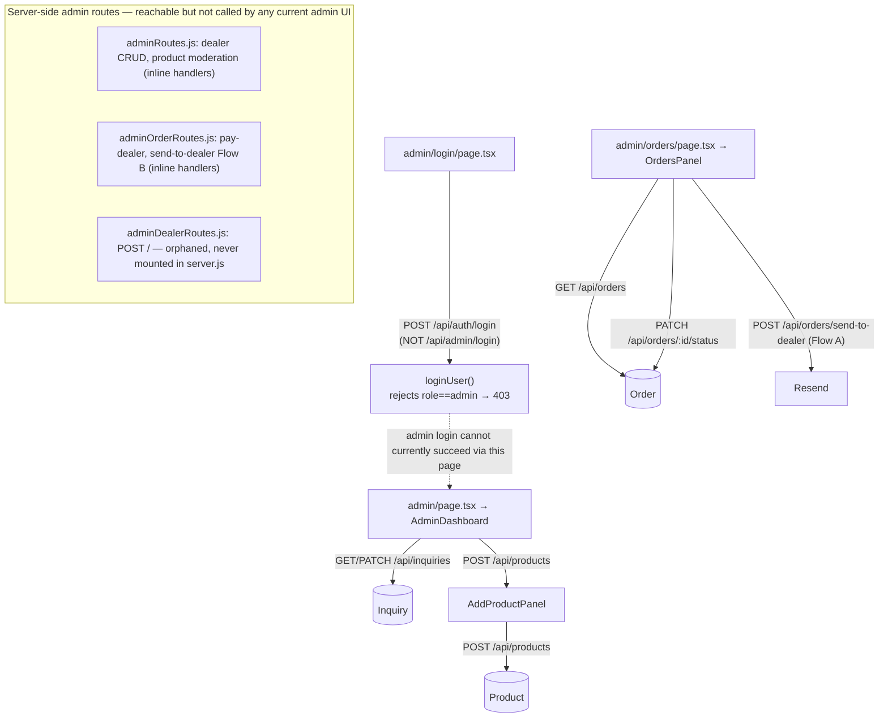

Two independent client-side admin guards exist (`admin/layout.tsx`'s inline check and `components/auth/AdminGuard.tsx`), both doing a `localStorage`-only role check with no server verification. The dealer-management and product-moderation admin endpoints exist server-side but no current admin UI component calls them — either dead server code, or a missing admin UI surface, depending on intent.

---

## 11. API Request Lifecycle

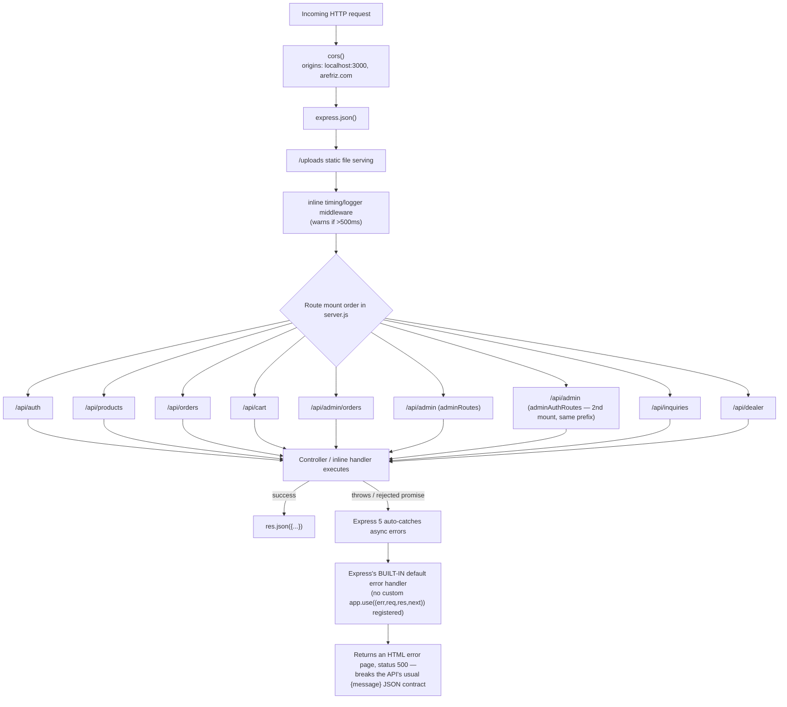

`package.json` confirms Express `^5.2.1`, which auto-forwards rejected promises from `async` handlers to the error pipeline (unlike Express 4). Because no custom error-handling middleware is registered, any uncaught error in a try/catch-less handler (several exist in `cartController.js`, `productController.js`, `authController.js`) surfaces as Express's default HTML error page instead of the application's normal JSON error shape — inconsistent, but it does not crash the process.

---

## 12. State Management

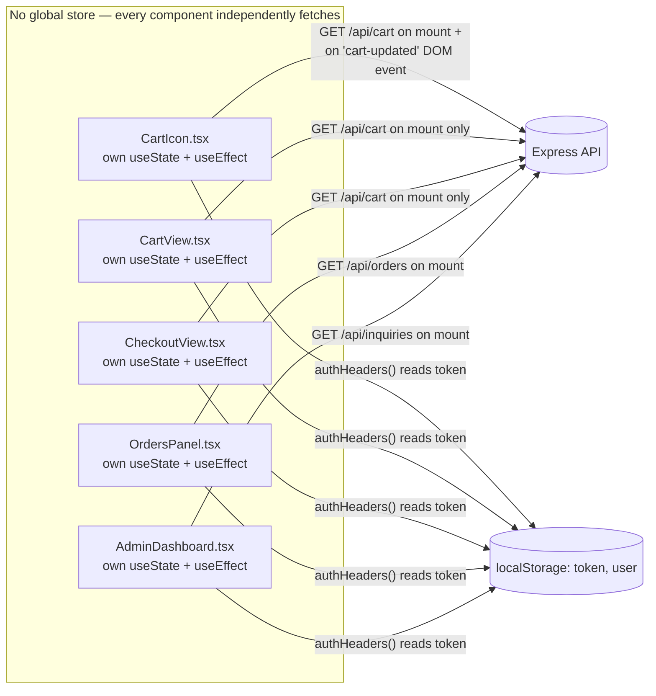

An exhaustive search for `createContext`, `useContext`, Redux, or Zustand across `frontend/src` returned zero matches — there is no global/shared state layer anywhere in the frontend. Auth/session state is read independently from `localStorage` by every component that needs it (no single source of truth). Cart state specifically has no shared cache between `CartIcon` and `CartView`/`CheckoutView`: cross-component sync relies entirely on an untyped `window.dispatchEvent(new Event("cart-updated"))` DOM event with no payload, which — combined with the `items`/`products` field-name bug (§6) — means the nav badge, cart page, and checkout page can each show different cart contents at the same time.

---

## 13. Current Architecture Weaknesses

(Full file-level detail in `docs/PROJECT_AUDIT.md`; this list frames the same findings at the system-design level.)

- **No shared API contract** between frontend and backend — the cart response shape drifted (`items` vs. `products`) with nothing to catch it (no shared types, no schema validation, no contract tests).
- **No single source of truth for frontend state** — every component fetches independently; cart state can visibly diverge across the nav badge, cart page, and checkout page.
- **Checkout trusts client-submitted order data** — line items, quantities, and cost breakdown come from the client payload with only per-item price/name re-verified server-side; the DB cart's own `totalAmount` is never cross-checked.
- **Unguarded order state machine** — any of the four statuses can transition to any other, by either an admin or the assigned dealer, with no transition table; several schema fields (`placed`, `released`, `dealerPayoutStatus`, `statusHistory`) are dead, never written.
- **Two competing implementations** of the same business capability (dealer email notification) using different providers, templates, and request shapes — a maintenance and correctness risk (e.g. a fix applied to one path silently doesn't apply to the other).
- **Admin login is broken end-to-end** in the current wiring — the admin login page calls the customer login endpoint, which explicitly rejects admin accounts.
- **No centralized error handling** — inconsistent error shapes and, for handlers without try/catch, HTML error pages returned from a JSON API.
- **A frozen, fully diverged duplicate of the entire backend** (`backend/backend/`) exists in the repo, unreferenced by anything that runs, but a source of confusion for anyone (human or AI) reading the codebase.
- **Three separate, independently-implemented auth/role guards** on the frontend, all client-only `localStorage` checks with no server-side token validation at the routing layer.
- Plaintext admin credential file (`admin password.txt`) committed to the repository.
- No automated tests, no request validation library, no rate limiting, no structured logging — see PROJECT_AUDIT.md §17 for the full list.

---

## 14. Recommended Production Architecture

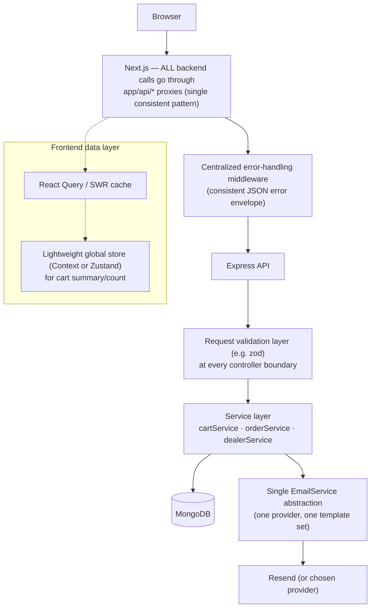

Concrete recommendations, grouped by area:

**Contract & data flow**
- Define shared types (or an OpenAPI/zod schema) for `Cart`, `Order`, and `Product` shapes, generated or hand-synced into both `frontend` and `backend` — would have caught the `items`/`products` drift at build time instead of at runtime.
- Make the server the sole source of truth for checkout pricing: recompute shipping/tax/installation from server-side rules and the authoritative DB cart, rather than trusting client-submitted cost fields.

**State management**
- Introduce a data-fetching cache (React Query or SWR) so cart/order data is fetched once and shared, not independently re-fetched per component.
- Add a small global store (Context is sufficient at this scale) for cart summary/count so `CartIcon` updates reactively on mutation instead of via an untyped DOM event.
- Consolidate the three auth/admin guards into one shared guard component/hook.

**Backend robustness**
- Add a single centralized Express error-handling middleware returning a consistent `{message}` JSON shape for every failure path.
- Add a request-validation layer (zod/joi) at controller boundaries instead of ad-hoc `if (!x)` checks.
- Add an explicit order-status transition table/guard; retire the dead enum values or start using them consistently.
- Collapse the two dealer-email implementations into one `emailService.sendDealerNotification(order)` call, used by a single endpoint.
- Replace `console.*` with a structured logger; remove logging of credentials/tokens entirely.

**Security & ops**
- Delete `admin password.txt` from the repo and rotate that credential; add it (and `uploads/`) to `.gitignore` appropriately.
- Add `.env.example` documenting required environment variables; validate required secrets at process startup.
- Add `helmet` and basic rate limiting.
- Consider moving JWTs to httpOnly cookies to reduce XSS exposure, or explicitly document the accepted trade-off if `localStorage` is kept.

**Housekeeping**
- Remove the `backend/backend/` frozen duplicate entirely — it carries no active value and is a source of confusion.
- Add an automated test suite (unit tests for controllers/services at minimum; integration tests for the auth/cart/checkout flows given how much drift has already occurred there undetected).

This section is a design recommendation only — no changes have been made to the codebase as part of this document.
